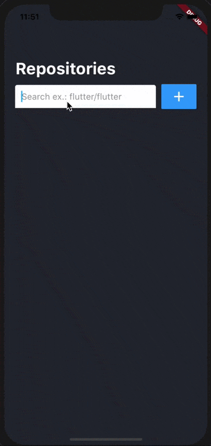

<p align="center">
  <a href="https://flutter.io/">
    
  </a>

  <h1 align="center">flutter-github-repositories</h1>

  <p align="center">
    Application developed in Flutter to search and list Github repositories for Android and iOS
    <br>
    <br>
    <a href="https://github.com/cleandersonlobo/flutter-github-repositories/issues/new">Report bug</a>
    ·
    <a href="https://github.com/cleandersonlobo/flutter-github-repositories/issues/new">Request feature</a>
  </p>
</p>

## Quick start

This is a normal flutter app. You should follow the instructions in the [official documentation](https://flutter.io/docs/get-started/install).

### Installation

Clone repository:
```sh
git clone https://github.com/cleandersonlobo/flutter-github-repositories.git
```

## Running

Once dependencies are installed, run the starter kit with:

```sh
flutter run
```

### Screenshots




## Getting Started

This project is a starting point for a Flutter application.

A few resources to get you started if this is your first Flutter project:

- [Lab: Write your first Flutter app](https://flutter.dev/docs/get-started/codelab)
- [Cookbook: Useful Flutter samples](https://flutter.dev/docs/cookbook)

For help getting started with Flutter, view our 
[online documentation](https://flutter.dev/docs), which offers tutorials, 
samples, guidance on mobile development, and a full API reference.


## Thanks 

## License

MIT
